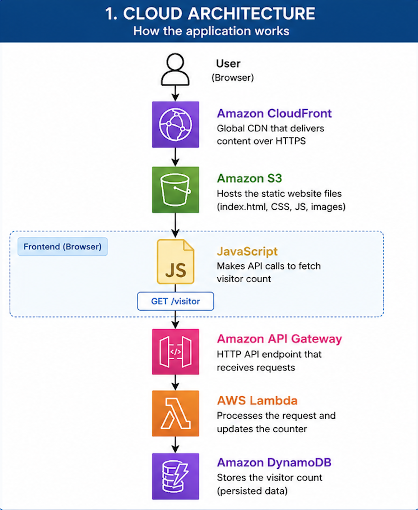
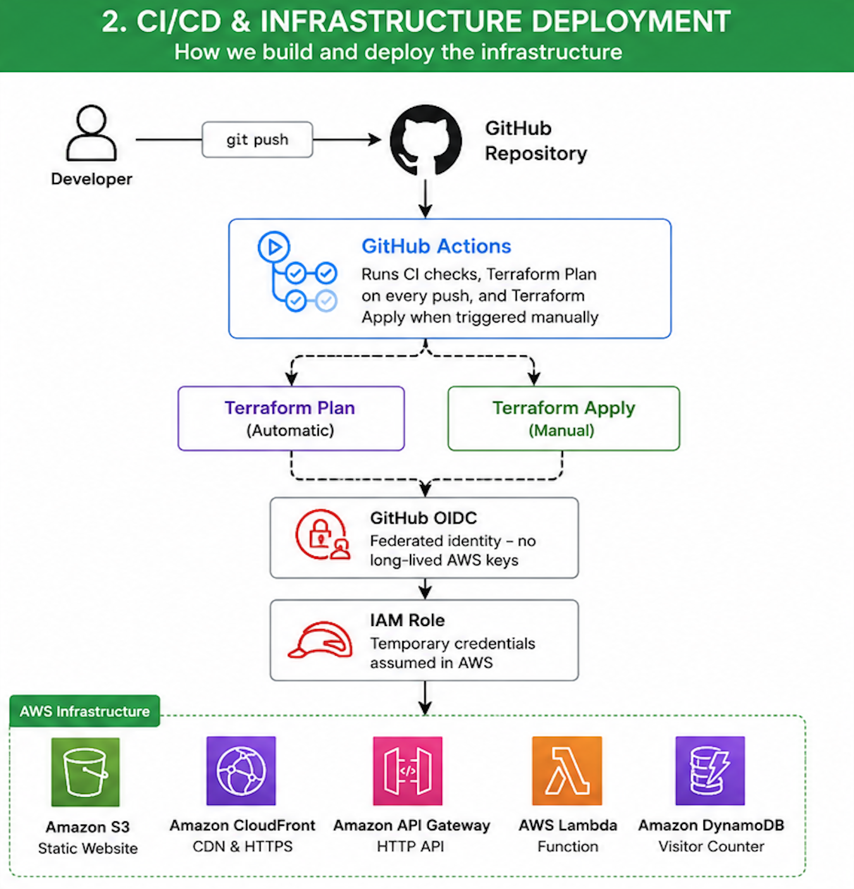

# ☁️ Cloud Resume Challenge (AWS + Terraform + GitHub Actions)

A production-style implementation of the Cloud Resume Challenge built on AWS using Infrastructure as Code (Terraform) and a secure CI/CD pipeline with GitHub Actions and OpenID Connect (OIDC).

This project provisions and manages cloud infrastructure entirely with Terraform, deploys a static website through Amazon CloudFront, serves a serverless visitor counter API using AWS Lambda and API Gateway, stores visitor counts in DynamoDB, and automates deployments through GitHub Actions.

---

## Live Demo

🌐 **Website:** https://d3122lu6epep19.cloudfront.net/
---

# Architecture

## Application Architecture



### Request Flow

1. A visitor accesses the website through Amazon CloudFront.
2. CloudFront serves the static frontend hosted in Amazon S3.
3. JavaScript running in the browser sends a request to the visitor counter API.
4. Amazon API Gateway receives the request.
5. AWS Lambda updates and retrieves the visitor count.
6. Amazon DynamoDB stores the visitor count.
7. The updated count is returned to the frontend and displayed.

---

## CI/CD Pipeline



### Deployment Flow

1. Developer pushes code to GitHub.
2. GitHub Actions automatically runs:
   - Terraform formatting
   - Terraform validation
   - Terraform Plan
3. Terraform Plan assumes a dedicated read-only IAM role using GitHub OIDC.
4. Infrastructure changes are reviewed.
5. Terraform Apply is triggered manually.
6. GitHub Actions assumes a deployment IAM role.
7. Terraform provisions AWS infrastructure.
8. CloudFront cache is automatically invalidated after deployment.

---

# Features

- Static website hosted on Amazon S3
- Global content delivery using Amazon CloudFront
- HTTPS support
- Serverless backend using AWS Lambda
- REST API with Amazon API Gateway
- Visitor counter stored in Amazon DynamoDB
- Infrastructure managed with Terraform
- Remote Terraform state stored in Amazon S3
- State locking support
- GitHub Actions CI/CD pipeline
- OIDC authentication (no long-lived AWS credentials)
- Separate IAM roles for Terraform Plan and Terraform Apply
- Automatic CloudFront cache invalidation after deployments

---

# AWS Services Used

| Service | Purpose |
|----------|---------|
| Amazon S3 | Static website hosting |
| Amazon CloudFront | CDN and HTTPS |
| API Gateway | HTTP API endpoint |
| AWS Lambda | Visitor counter backend |
| Amazon DynamoDB | Visitor count storage |
| IAM | Roles and permissions |
| GitHub Actions | CI/CD pipeline |
| Terraform | Infrastructure as Code |

---

# Repository Structure

```text
cloud-resume-challenge/
│
├── backend/                 # Lambda source code
├── bootstrap/               # Bootstrap infrastructure
├── docs/
│   ├── architecture.png
│   ├── cicd.png
│   └── screenshots/
├── frontend/                # Static website
├── terraform/               # Main infrastructure
├── .github/
│   └── workflows/
│       ├── ci.yml
│       ├── terraform-plan.yml
│       └── terraform-apply.yml
├── README.md
└── .gitignore
```

---

# Infrastructure as Code

Infrastructure is fully managed using Terraform.

Resources include:

- Amazon S3
- CloudFront Distribution
- API Gateway HTTP API
- Lambda Function
- DynamoDB Table
- IAM Roles
- IAM Policies
- CloudFront Origin Access Control
- Lambda Permissions

Remote state is stored in Amazon S3 with state locking enabled.

---

# CI/CD

Every push to the `main` branch automatically runs:

- Terraform fmt
- Terraform validate
- Terraform Plan

Terraform Apply is intentionally separated into a manual workflow for safe production deployments.

Authentication between GitHub Actions and AWS uses OpenID Connect (OIDC), eliminating the need for long-lived AWS access keys.

---

# Security

This project follows several AWS security best practices.

- Infrastructure managed through IAM roles instead of IAM users
- GitHub OIDC federation for temporary AWS credentials
- No AWS access keys stored in GitHub
- Separate IAM roles for planning and deployment
- Principle of least privilege
- CloudFront Origin Access Control (OAC)
- Remote Terraform state with state locking

---

# Future Improvements

- Custom domain using Route53
- AWS Certificate Manager (ACM)
- Terraform modules
- Multiple deployment environments (dev / staging / production)
- Automated integration testing
- Monitoring with Amazon CloudWatch
- GitHub Pull Request preview deployments

---

# Skills Demonstrated

- AWS
- Terraform
- Infrastructure as Code
- GitHub Actions
- CI/CD
- OpenID Connect (OIDC)
- IAM
- Serverless Architecture
- API Gateway
- Lambda
- DynamoDB
- CloudFront
- Amazon S3
- Remote Terraform State
- Cloud Infrastructure Automation

---

# Author

**Jinghan Fu**

Cloud Engineer | AWS | Terraform | Infrastructure as Code
